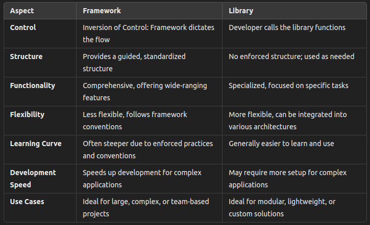

# Framework VS Library
## Framework
A framework is a pre-built structure or environment designed to simplify the development process by providing foundational elements and guiding architecture.

[More details](./Framework/README.md)

## Library
A library is a collection of pre-written code that developers can use to perform common tasks.

[More details](./Library/README.md)

## Comparison
A `framework` enforces a pre-built structure or architecture, a `library` does not enforce a particular structure or flow of control; instead, it provides tools and functions that developers can call as needed.

- The framework will tell you where to put your code, but will call your code as needed. Simply put, your code calls the code in the library, but in the framework it is the code in the framework that calls the code
- A framework is a set of pre-written code that provides a structure for developing software applications. A library, on the other hand, is a collection of pre-written code that can be used to perform specific tasks.  
- Framework defines the overall architecture of the application and provides a common set of conventions for building and maintaining the code. Library is typically smaller in scope than a framework and is intended to be used as a tool to help developers accomplish specific tasks. 
- A framework as a collection of libraries, but completely different. Use libraries to control program flow. Access your library anytime, anywhere. On the other hand, with a framework, the flow is controlled by the framework. 
- Frameworks tend to be more tightly coupled to the application, meaning that the framework’s code is closely interwoven with the application’s code. Libraries are typically more loosely coupled, meaning that the library’s code can be used independently of the application’s code.
- Frameworks provide a more comprehensive set of functionality and often include a wide variety of pre-built components. Libraries tend to be more specialized and provide a specific set of functions or tools.
- Frameworks can be more rigid and may limit the developer’s ability to customize certain aspects of the application. Libraries are generally more flexible and can be easily replaced or swapped out if necessary.
- Frameworks often require a significant amount of code to be written by the developer to work with the framework, whereas libraries are typically easier to integrate and depend on the use case.You just have to install it.
- Frameworks are usually larger in size and may include many more files and classes than libraries, which are usually smaller and more focused.

#### References
- ChatGPT 4o
- [shiksha.com](https://www.shiksha.com/online-courses/articles/framework-vs-library/)