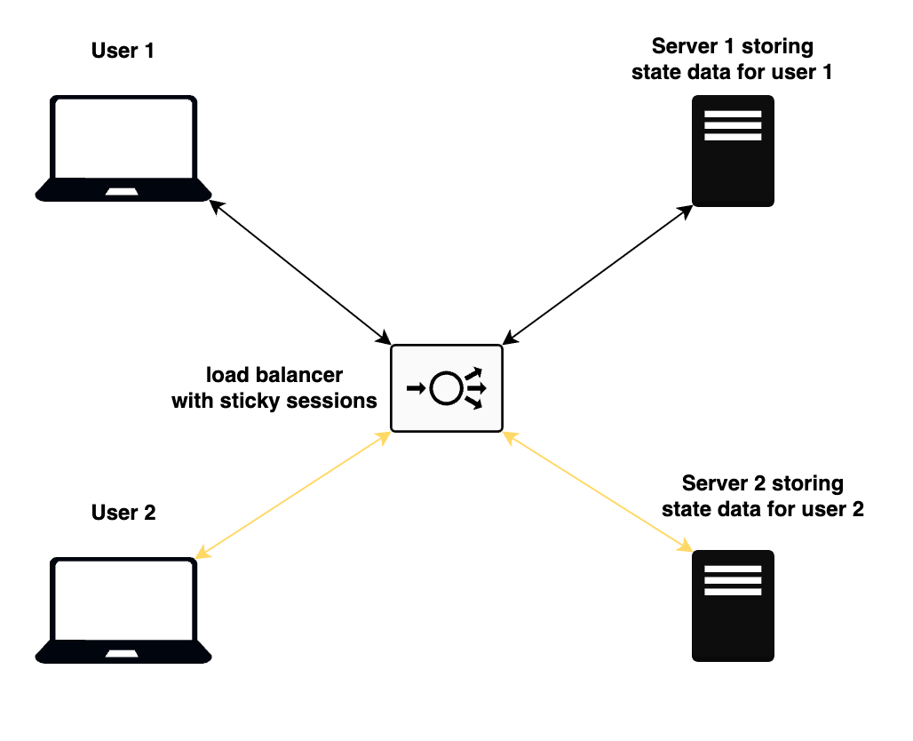

# State
In programming, `state` refers to the condition of a system, component, or application at a particular point in time.

`State` represents the data that is stored and used to keep track of the current status of the application. Understanding and managing `state` is crucial for building interactive and dynamic web applications.

The concept of a `state` crosses many boundaries in architecture. Design patterns (like REST and GraphQL), protocols (like HTTP and TCP), firewalls and functions can be stateful or stateless. But the underlying principle of `state` cutting across all of these domains remains the same.

## Stateful
`Stateful architecture` is one where the server maintains the state of interactions with clients. This means that the server keeps track of the information about the client's session and can provide context-aware responses based on the state of the client's previous requests.

**Diagram**: _Stateful application works_

The diagram shows two different users trying to access a web server through a load balancer. Since the application state is maintained on the servers, the users must always be routed to the same server for every single request in order to preserve state.

Sticky sessions is a configuration that allows the load balancer to route a user's requests consistently to the same backend server for the duration of their session. This is in contrast to traditional load balancing, where requests from a user can be directed to any available backend server in a round-robin or other load distribution pattern.

### Characteristics
- `Session Management`: The server retains information about the client sessions, typically using mechanisms like cookies, session IDs, or tokens.
- `Context Awareness`: Each request is understood in the context of previous requests from the same client.
- `Resource Intensive`: Maintaining state can be resource-intensive as the server needs to store session data and manage multiple client sessions concurrently.
- `Examples`: Online banking systems, multiplayer online games, and e-commerce applications often rely on stateful architectures for features like user authentication, shopping carts, and personalized experiences.

### Advantages
- Provides a seamless and personalized user experience by maintaining context.
- Enables complex interactions and workflows that depend on the continuity of client-server communication.

### Disadvantages
- Scalability challenges due to the need to manage and store state information.
- Increased complexity in handling server failures and session recovery.

#### References
- [freeCodeCamp.org](https://www.freecodecamp.org/news/stateful-vs-stateless-architectures-explained/)