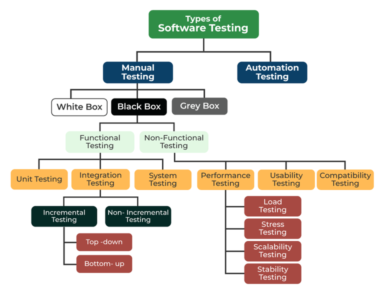

# Software Testing
Software testing is the process of evaluating and verifying that a software product or application does what it's supposed to do. It's a systematic approach to identify bugs, errors, or any potential issues that might hinder its functionality, performance, or usability.

## Manual Testing vs Automated Testing:
- `Manual Testing`: In the past, software companies relied on manual testing. QA teams would create detailed test plans and manually execute them whenever a new update or change was pushed to the software project. This process was slow, expensive, and error-prone.
- `Automated Testing`: Nowadays, automated testing is widely adopted. It involves writing test scripts that can be executed automatically by continuous integration (CI) tools. This approach puts ownership responsibilities in the hands of the engineering team and promotes efficiency.

## Continuous Integration (CI) and Continuous Delivery (CD):
- `CI`: Continuous integration runs automated tests against new code changes to verify that they don’t break existing features or introduce new bugs.
- `CD`: Continuous delivery ensures that code releases are delivered as quickly as possible to users. It relies on successful CI results to trigger the deployment process.

## Types of Software Testing
Testing is the process of executing a program to find errors. To make our software perform well it should be error-free. If testing is done successfully it will remove all the errors from the software. In this article, we will discuss first the principles of testing and then we will discuss, the different types of testing.

### Principles of Testing
- All the tests should meet the customer’s requirements.
To make our software testing should be performed by a third party.
- Exhaustive testing is not possible. As we need the optimal amount of testing based on the risk assessment of the application. 
- All the tests to be conducted should be planned before implementing it 
- It follows the Pareto rule(80/20 rule) which states that 80% of errors come from 20% of program components. 
Start testing with small parts and extend it to large parts. 

### Types
- Manual Testing
    - White Box
    - Black Box
        - Functional Testing
            - Unit Testing
            - Integration Testing
                - Incremental Testing
                    - Top-down
                    - Bottom-up
                - Non-incremental Testing
            - System Testing
        - Non-Functional Testing
            - Performance Testing
                - Load Testing
                - Stress Testing
                - Scalability Testing
                - Stablility Testing
            - Usability Testing
            - Compatibility Testing
    - Grey Box
- Automated Testing

## Benefits of Software Testing
Coming soon

## Challenges and Best Practices
Coming soon

## Tools and Frameworks
Coming soon

#### References
- [Types of Software Testing @geeksforgeeks.org](https://www.geeksforgeeks.org/types-software-testing/)
